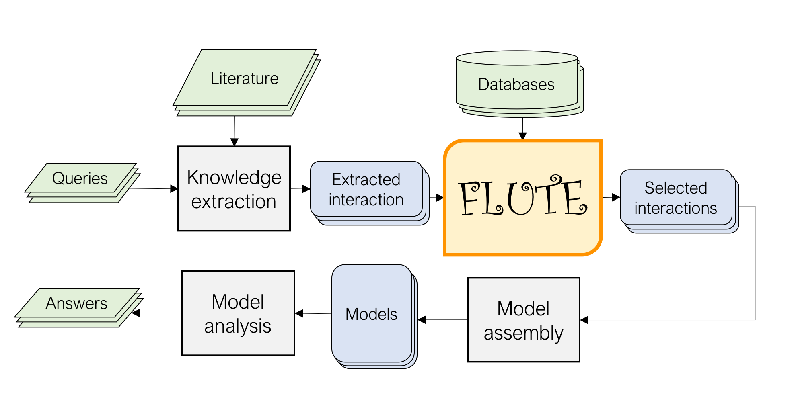

.. FLUTE documentation master file, created by
   sphinx-quickstart on Tue Mar 30 14:02:13 2021.
   You can adapt this file completely to your liking, but it should at least
   contain the root `toctree` directive.

Welcome to FLUTE's documentation!
=================================
Understanding disease at the cellular level requires detailed knowledge of signaling networks. To aid in this task, many advances have been made in the field of natural language processing (NLP) to extract signaling events from biomedical literature. 

However, even state-of-the-art NLP methods incorrectly interpret some signaling events described in the literature. 

The FiLter for Understanding True Events (FLUTE) tool seeks to identify high-confidence signaling events from biomedical NLP output by comparing with existing biological databases. As such, FLUTE can reliably determine the confidence in the biomolecular events extracted by NLP methods and at the same time provide a speedup in event filtering by three orders of magnitude.

.. toctree::
   :maxdepth: 2
   :caption: Contents:

   Installation
   Usage
   run_FLUTE
   Legal
   Funding

Indices and tables
==================

* :ref:`genindex`
* :ref:`modindex`
* :ref:`search`

Copyright (c) 2023 Emilee Holtzapple, Miskov-Zivanov Lab (MeLoDy lab)