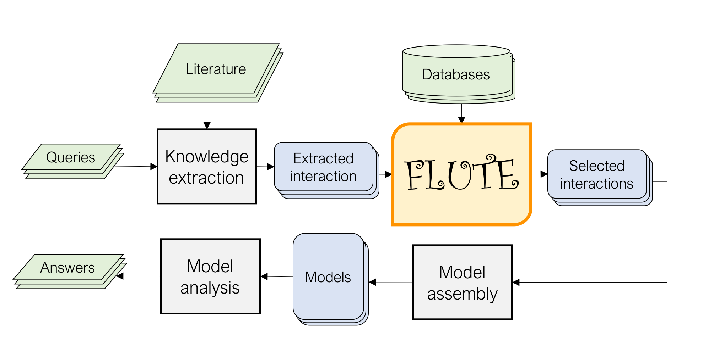

Welcome to FLUTE's documentation!
=================================
.. image:: https://readthedocs.org/projects/melody-flute/badge/?version=latest
    :target: https://melody-flute.readthedocs.io/en/latest/?badge=latest
    :alt: Documentation Status

Understanding disease at the cellular level requires detailed knowledge of signaling networks. To aid in this task, many advances have been made in the field of natural language processing (NLP) to extract signaling events from biomedical literature.

However, even state-of-the-art NLP methods incorrectly interpret some signaling events described in the literature.

The FiLter for Understanding True Events (FLUTE) tool seeks to identify high-confidence signaling events from biomedical NLP output by comparing with existing biological databases. As such, FLUTE can reliably determine the confidence in the biomolecular events extracted by NLP methods and at the same time provide a speedup in event filtering by three orders of magnitude.

.. toctree::
   :maxdepth: 2
   :caption: Contents

   prerequisite
   notebook
   notebook_link
   usage
   functions
   legal